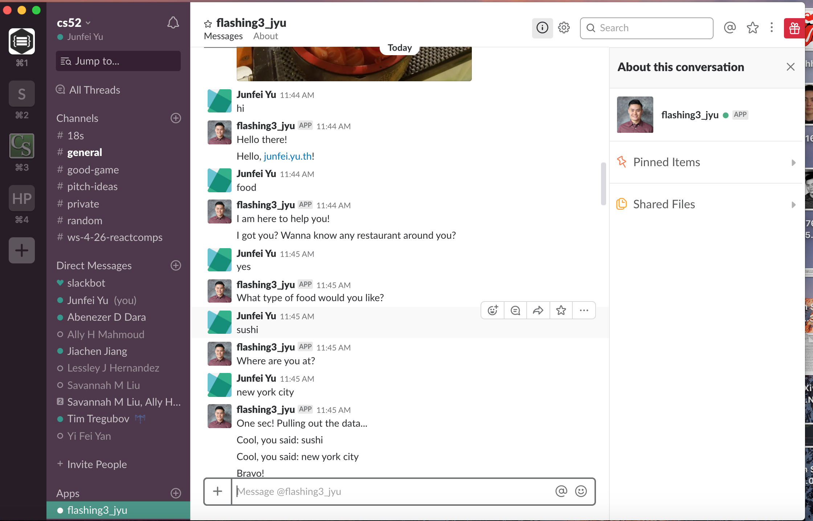
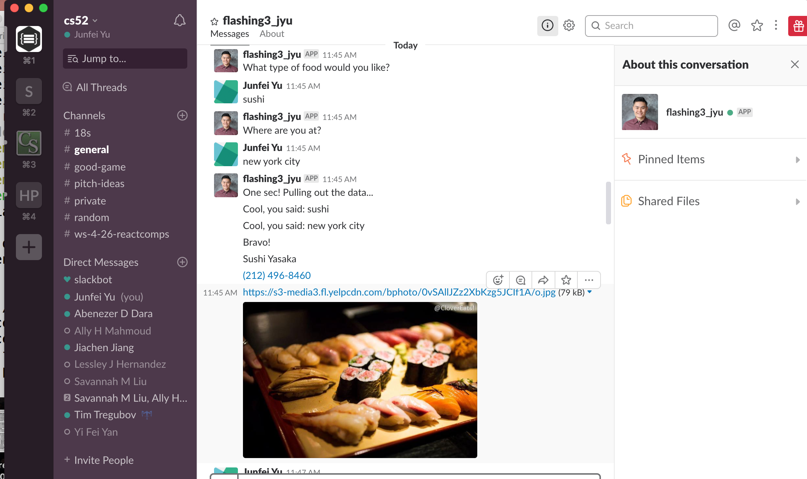

# Introduction

In this short assignment, I implemented a chatbot for Slack for searching for nearby restaurant based upon the desired food and the location which the user chose.

# Tools:

 - [Botkit](https://botkit.ai/)  - Building Blocks for Building Bots
 - [Yelp Fusion API client for Node.js with Promises](https://github.com/tonybadguy/yelp-fusion)

# Functionalities:

 - respond to hi and random messages
 - return results for a restaurant query
 - carry on one conversation
 - send back an attachment message in response to something.
 - wake up on an outgoing webhook from #bots

# Pictures

